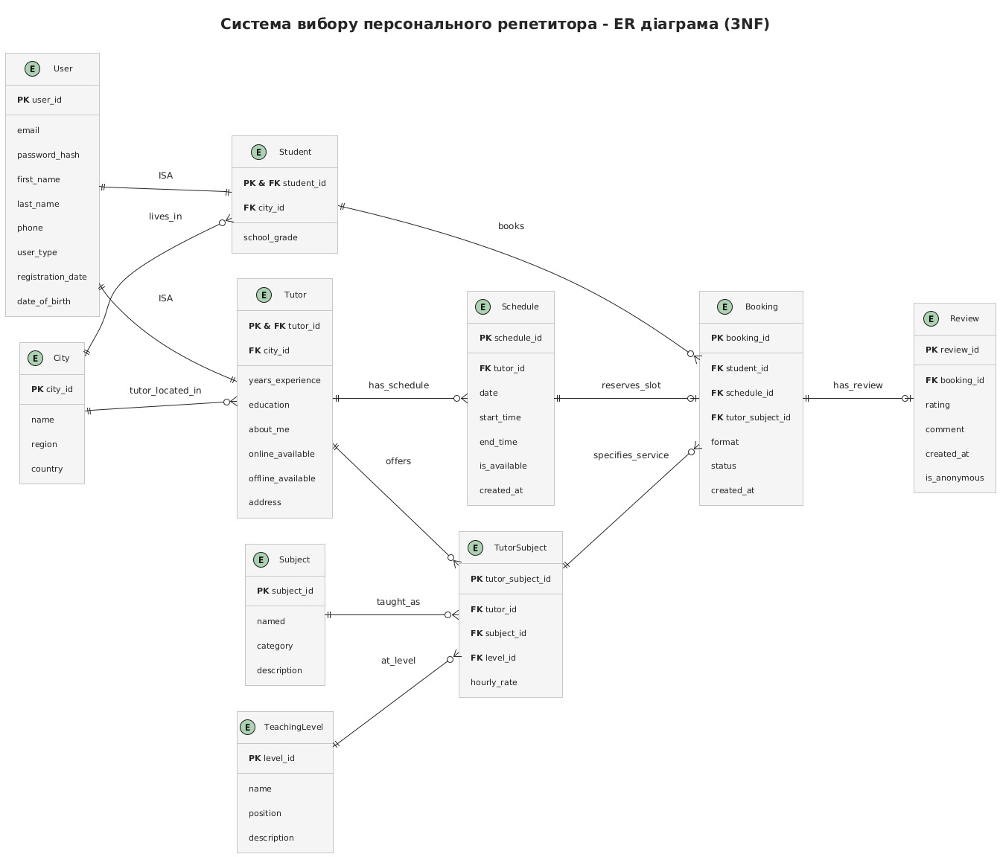

# Документація схеми бази даних

## Діаграма сутність-зв'язок (ERD)

---

## ENUM Типи 

Використовується три користувацькі типи для забезпечення цілісності даних:

### `user_type`
Визначає тип користувача в системі:
- `student` - учень/студент, який шукає репетитора
- `tutor` - репетитор, який надає послуги навчання

### `booking_format`
Визначає формат проведення заняття:
- `online` - онлайн заняття (дистанційне)
- `offline` - офлайн заняття (очне, фізична присутність)

### `booking_status`
Визначає статус бронювання заняття:
- `pending` - очікує підтвердження репетитором
- `confirmed` - підтверджено обома сторонами
- `completed` - заняття завершено
- `cancelled` - бронювання скасовано

---

## Опис таблиць

### Таблиця: `user`

**Призначення:** центральна таблиця для зберігання базової інформації про всіх користувачів системи.

**Стовпці:**
| Стовпець | Тип | Обмеження | Опис |
|----------|-----|-----------|------|
| user_id | INTEGER | PRIMARY KEY, GENERATED ALWAYS AS IDENTITY | Унікальний ідентифікатор користувача |
| first_name | VARCHAR(100) | NOT NULL | Ім'я користувача |
| last_name | VARCHAR(100) | NOT NULL | Прізвище користувача |
| email | VARCHAR(255) | UNIQUE, NOT NULL | Електронна пошта для входу в систему |
| password_hash | VARCHAR(255) | NOT NULL | Хешований пароль користувача |
| phone | VARCHAR(20) | UNIQUE, NULL | Номер телефону (опціонально) |
| user_type | user_type | NOT NULL | Тип користувача (student або tutor) |
| date_of_birth | DATE | NULL | Дата народження (опціонально) |
| registration_date | TIMESTAMP WITH TIME ZONE | DEFAULT CURRENT_TIMESTAMP | Дата та час реєстрації в системі |

**Індекси:**
- Первинний ключ на `user_id` (автоматично створюється)
- Унікальний індекс на `email` (автоматично створюється через UNIQUE)
- Унікальний індекс на `phone` (автоматично створюється через UNIQUE)

**Зв'язки:**
- Один-до-нуля-або-одного зі `student` (один користувач може бути студентом)
- Один-до-нуля-або-одного з `tutor` (один користувач може бути репетитором)

---

### Таблиця: `city`

**Призначення:** зберігає інформацію про міста для визначення місцезнаходження користувачів та проведення офлайн занять.

**Стовпці:**
| Стовпець | Тип | Обмеження | Опис |
|----------|-----|-----------|------|
| city_id | INTEGER | PRIMARY KEY, GENERATED ALWAYS AS IDENTITY | Унікальний ідентифікатор міста |
| name | VARCHAR(100) | NOT NULL | Назва міста |
| region | VARCHAR(100) | NULL | Регіон/область (опціонально) |
| country | VARCHAR(100) | NOT NULL, DEFAULT 'Україна' | Країна |

**Індекси:**
- Первинний ключ на `city_id`
- Унікальний індекс на `(name, region, country)` через CONSTRAINT

**Зв'язки:**
- Один-до-багатьох зі `student` (місто може мати багато студентів)
- Один-до-багатьох з `tutor` (місто може мати багато репетиторів)

---

### Таблиця: `student`

**Призначення:** зберігає специфічну інформацію про студентів (учнів), що доповнює базову інформацію з таблиці `user`.

**Стовпці:**
| Стовпець | Тип | Обмеження | Опис |
|----------|-----|-----------|------|
| student_id | INTEGER | PRIMARY KEY, FOREIGN KEY → user(user_id) | Ідентифікатор студента (дорівнює user_id) |
| city_id | INTEGER | FOREIGN KEY → city(city_id), NULL | Місто проживання студента |
| school_grade | SMALLINT | NULL | Клас або курс навчання |

**Індекси:**
- Первинний ключ на `student_id`
- `idx_student_city_id` на `city_id` (для пошуку студентів за містом)

**Зв'язки:**
- Один-до-одного з `user` (кожен student відповідає одному user)
  - ON DELETE CASCADE - при видаленні користувача видаляється і запис студента
- Багато-до-одного з `city` (багато студентів можуть жити в одному місті)
  - ON DELETE SET NULL - при видаленні міста поле обнуляється

---

### Таблиця: `tutor`

**Призначення:** зберігає специфічну інформацію про репетиторів, включаючи досвід, освіту та доступність для різних форматів занять.

**Стовпці:**
| Стовпець | Тип | Обмеження | Опис |
|----------|-----|-----------|------|
| tutor_id | INTEGER | PRIMARY KEY, FOREIGN KEY → user(user_id) | Ідентифікатор репетитора (дорівнює user_id) |
| city_id | INTEGER | FOREIGN KEY → city(city_id), NULL | Місто знаходження репетитора |
| years_experience | SMALLINT | NOT NULL, DEFAULT 0 | Кількість років досвіду викладання |
| education | TEXT | NOT NULL | Опис освіти репетитора |
| about_me | TEXT | NULL | Інформація про себе, біографія |
| online_available | BOOLEAN | NOT NULL, DEFAULT TRUE | Доступність для онлайн занять |
| offline_available | BOOLEAN | NOT NULL, DEFAULT TRUE | Доступність для офлайн занять |
| address | TEXT | NULL | Адреса для проведення офлайн занять |

**Індекси:**
- Первинний ключ на `tutor_id`
- `idx_tutor_city_id` на `city_id` (для пошуку репетиторів за містом)

**Зв'язки:**
- Один-до-одного з `user` (кожен tutor відповідає одному user)
  - ON DELETE CASCADE - при видаленні користувача видаляється і запис репетитора
- Багато-до-одного з `city` (багато репетиторів можуть працювати в одному місті)
  - ON DELETE SET NULL - при видаленні міста поле обнуляється
- Один-до-багатьох з `tutor_subject` (репетитор може викладати багато предметів)
- Один-до-багатьох з `schedule` (репетитор має багато часових слотів у розкладі)

**Додаткові обмеження:**
- CHECK: `online_available = TRUE OR offline_available = TRUE` (хоча б один формат має бути доступний)
- CHECK: `offline_available = FALSE OR (offline_available = TRUE AND city_id IS NOT NULL AND address IS NOT NULL)` (для офлайн занять потрібні місто та адреса)

---

### Таблиця: `subject`

**Призначення:** довідник предметів, які можуть викладати репетитори.

**Стовпці:**
| Стовпець | Тип | Обмеження | Опис |
|----------|-----|-----------|------|
| subject_id | INTEGER | PRIMARY KEY, GENERATED ALWAYS AS IDENTITY | Унікальний ідентифікатор предмета |
| name | VARCHAR(100) | UNIQUE, NOT NULL | Назва предмета (наприклад, "Математика", "Англійська мова") |
| category | VARCHAR(100) | NOT NULL | Категорія предмета (наприклад, "Точні науки", "Мови") |
| description | TEXT | NULL | Детальний опис предмета |

**Індекси:**
- Первинний ключ на `subject_id`
- Унікальний індекс на `name`

**Зв'язки:**
- Один-до-багатьох з `tutor_subject` (предмет може викладатися багатьма репетиторами)

---

### Таблиця: `teaching_level`

**Призначення:** довідник рівнів викладання (наприклад, початковий, середній, просунутий).

**Стовпці:**
| Стовпець | Тип | Обмеження | Опис |
|----------|-----|-----------|------|
| level_id | INTEGER | PRIMARY KEY, GENERATED ALWAYS AS IDENTITY | Унікальний ідентифікатор рівня |
| name | VARCHAR(100) | UNIQUE, NOT NULL | Назва рівня (наприклад, "Початковий", "ЗНО") |
| position | SMALLINT | UNIQUE, NOT NULL | Позиція для сортування рівнів від меншого до більшого |
| description | TEXT | NULL | Опис рівня викладання |

**Індекси:**
- Первинний ключ на `level_id`
- Унікальний індекс на `name`
- Унікальний індекс на `position`

**Зв'язки:**
- Один-до-багатьох з `tutor_subject` (рівень може використовуватися багатьма репетиторами)

---

### Таблиця: `tutor_subject`

**Призначення:** зв'язкова таблиця, що визначає які предмети на яких рівнях викладає репетитор та за якою ціною.

**Стовпці:**
| Стовпець | Тип | Обмеження | Опис |
|----------|-----|-----------|------|
| tutor_subject_id | INTEGER | PRIMARY KEY, GENERATED ALWAYS AS IDENTITY | Унікальний ідентифікатор запису |
| tutor_id | INTEGER | FOREIGN KEY → tutor(tutor_id), NOT NULL | Ідентифікатор репетитора |
| subject_id | INTEGER | FOREIGN KEY → subject(subject_id), NOT NULL | Ідентифікатор предмета |
| level_id | INTEGER | FOREIGN KEY → teaching_level(level_id), NOT NULL | Ідентифікатор рівня викладання |
| hourly_rate | DECIMAL(8,2) | NOT NULL | Почасова ставка за заняття |

**Індекси:**
- Первинний ключ на `tutor_subject_id`
- Унікальний індекс на `(tutor_id, subject_id, level_id)`
- `idx_tutor_subject_subject_id` на `subject_id` (для пошуку репетиторів за предметом)

**Зв'язки:**
- Багато-до-одного з `tutor` (один репетитор може мати багато записів)
  - ON DELETE CASCADE - при видаленні репетитора видаляються всі його предмети
- Багато-до-одного з `subject` (один предмет може викладатися багатьма репетиторами)
  - ON DELETE CASCADE - при видаленні предмета видаляються всі зв'язки
- Багато-до-одного з `teaching_level` (один рівень може використовуватися багатьма записами)
  - ON DELETE CASCADE - при видаленні рівня видаляються всі зв'язки
- Один-до-багатьох з `booking` (один запис tutor-subject може використовуватися в багатьох бронюваннях)

**Додаткові обмеження:**
- UNIQUE на `(tutor_id, subject_id, level_id)` - репетитор не може мати дублікатів комбінації предмет+рівень

---

### Таблиця: `schedule`

**Призначення:** зберігає розклад доступних часових слотів репетиторів для бронювання занять.

**Стовпці:**
| Стовпець | Тип | Обмеження | Опис |
|----------|-----|-----------|------|
| schedule_id | INTEGER | PRIMARY KEY, GENERATED ALWAYS AS IDENTITY | Унікальний ідентифікатор часового слота |
| tutor_id | INTEGER | FOREIGN KEY → tutor(tutor_id), NOT NULL | Ідентифікатор репетитора |
| date | DATE | NOT NULL | Дата проведення заняття |
| start_time | TIME | NOT NULL | Час початку слота |
| end_time | TIME | NOT NULL | Час закінчення слота |
| is_available | BOOLEAN | NOT NULL, DEFAULT TRUE | Чи доступний слот для бронювання |
| created_at | TIMESTAMP WITH TIME ZONE | DEFAULT CURRENT_TIMESTAMP | Час створення слота в системі |

**Індекси:**
- Первинний ключ на `schedule_id`
- Унікальний індекс на `(tutor_id, date, start_time, end_time)`
- `idx_schedule_tutor_availability` на `(tutor_id, is_available)` (для швидкого пошуку доступних слотів)

**Зв'язки:**
- Багато-до-одного з `tutor` (один репетитор має багато слотів)
  - ON DELETE CASCADE - при видаленні репетитора видаляються всі його слоти
- Один-до-нуля-або-одного з `booking` (слот може бути заброньований максимум один раз)

**Додаткові обмеження:**
- CHECK: `date >= CURRENT_DATE` (неможливо створити слот у минулому)
- CHECK: `end_time > start_time` (час закінчення має бути пізніше початку)
- CHECK: `EXTRACT(EPOCH FROM (end_time - start_time)) / 60 = 60` (тривалість слота рівно 60 хвилин)
- UNIQUE на `(tutor_id, date, start_time, end_time)` (запобігає дублюванню слотів)

---

### Таблиця: `booking`

**Призначення:** зберігає інформацію про бронювання занять студентами у репетиторів.

**Стовпці:**
| Стовпець | Тип | Обмеження | Опис |
|----------|-----|-----------|------|
| booking_id | INTEGER | PRIMARY KEY, GENERATED ALWAYS AS IDENTITY | Унікальний ідентифікатор бронювання |
| student_id | INTEGER | FOREIGN KEY → student(student_id), NOT NULL | Ідентифікатор студента, який бронює |
| tutor_subject_id | INTEGER | FOREIGN KEY → tutor_subject(tutor_subject_id), NOT NULL | Предмет та рівень, що бронюється |
| schedule_id | INTEGER | FOREIGN KEY → schedule(schedule_id), UNIQUE, NOT NULL | Часовий слот для заняття |
| format | booking_format | NOT NULL | Формат проведення заняття (online/offline) |
| status | booking_status | NOT NULL, DEFAULT 'pending' | Поточний статус бронювання |
| created_at | TIMESTAMP WITH TIME ZONE | DEFAULT CURRENT_TIMESTAMP | Час створення бронювання |

**Індекси:**
- Первинний ключ на `booking_id`
- Унікальний індекс на `schedule_id`
- `idx_booking_student_id` на `student_id` (для отримання всіх бронювань студента)

**Зв'язки:**
- Багато-до-одного зі `student` (студент може мати багато бронювань)
  - ON DELETE CASCADE - при видаленні студента видаляються всі його бронювання
- Багато-до-одного з `tutor_subject` (одна комбінація репетитор-предмет може використовуватися в багатьох бронюваннях)
  - ON DELETE CASCADE - при видаленні tutor_subject видаляються всі пов'язані бронювання
- Один-до-одного з `schedule` (один слот може бути заброньований тільки один раз)
  - ON DELETE CASCADE - при видаленні слота видаляється бронювання
- Один-до-нуля-або-одного з `review` (бронювання може мати максимум один відгук)

**Додаткові обмеження:**
- UNIQUE на `schedule_id` - запобігає подвійному бронюванню одного слота

---

### Таблиця: `review`

**Призначення:** зберігає відгуки студентів про проведені заняття з репетиторами.

**Стовпці:**
| Стовпець | Тип | Обмеження | Опис |
|----------|-----|-----------|------|
| review_id | INTEGER | PRIMARY KEY, GENERATED ALWAYS AS IDENTITY | Унікальний ідентифікатор відгуку |
| booking_id | INTEGER | FOREIGN KEY → booking(booking_id), UNIQUE, NOT NULL | Бронювання, до якого відноситься відгук |
| rating | SMALLINT | NOT NULL, CHECK (1-5) | Оцінка від 1 до 5 |
| comment | TEXT | NULL | Текстовий коментар (опціонально) |
| created_at | TIMESTAMP WITH TIME ZONE | DEFAULT CURRENT_TIMESTAMP | Час створення відгуку |
| is_anonymous | BOOLEAN | NOT NULL, DEFAULT FALSE | Чи є відгук анонімним |

**Індекси:**
- Первинний ключ на `review_id`
- Унікальний індекс на `booking_id`
- `idx_review_rating` на `rating` (для фільтрації та аналізу за оцінками)

**Зв'язки:**
- Один-до-одного з `booking` (один відгук відповідає одному бронюванню)
  - ON DELETE CASCADE - при видаленні бронювання видаляється відгук

**Додаткові обмеження:**
- CHECK: `rating BETWEEN 1 AND 5` (оцінка тільки від 1 до 5)
- UNIQUE на `booking_id` - одне бронювання може мати тільки один відгук

---

## Рішення щодо дизайну

### Обрана структура схеми

**1. Table-Per-Type User <-> Student, Tutor**

Замість створення окремих таблиць для користувачів різних типів, використано єдину таблицю `user` з полем `user_type` та окремі таблиці `student` і `tutor` для специфічних даних. Це рішення забезпечує:
- Спільне зберігання базових даних (ім'я, email, пароль) без дублювання
- Можливість легко додавати нові типи користувачів у майбутньому
- Гнучкість у розширенні специфічної функціональності для кожного типу

**2. Багатостороння зв'язкова таблиця tutor_subject**

Таблиця `tutor_subject` зв'язує три сутності (tutor, subject, teaching_level) та додає атрибут `hourly_rate`. Це дозволяє:
- Репетитору викладати один предмет на різних рівнях з різними цінами
- Легко додавати/видаляти предмети без зміни структури
- Гнучко встановлювати ціни залежно від складності

**3. Незалежна таблиця розкладу**

Таблиця `schedule` створена незалежно від бронювань. Переваги:
- Репетитор може створювати слоти заздалегідь
- Простота перевірки доступності через поле `is_available`
- Можливість повторного використання слотів (якщо бронювання скасовано)
- Підтримка бізнес-логіки "60-хвилинні заняття" на рівні БД

**4. Каскадне видалення**

Широке використання `ON DELETE CASCADE` для:
- Автоматичного очищення пов'язаних даних при видаленні головної сутності
- Підтримки цілісності даних без необхідності вручну видаляти залежні записи
- Спрощення логіки додатку

### Досягнутий рівень нормалізації

База даних знаходиться в **третій нормальній формі (3NF)**:

**1NF (Перша нормальна форма):**
- ✅ Всі атрибути атомарні (немає масивів або складних типів)
- ✅ Кожна таблиця має первинний ключ
- ✅ Немає повторюваних груп стовпців

**2NF (Друга нормальна форма):**
- ✅ Виконуються умови 1NF
- ✅ Всі неключові атрибути повністю залежать від первинного ключа
- ✅ Немає часткових залежностей (у таблицях з композитними ключами)

**3NF (Третя нормальна форма):**
- ✅ Виконуються умови 2NF
- ✅ Немає транзитивних залежностей між неключовими атрибутами
- ✅ Кожен неключовий атрибут залежить тільки від первинного ключа

**Приклади дотримання 3NF:**
- Інформація про місто (`city`) винесена в окрему таблицю, а не дублюється в `student` та `tutor`
- Предмети (`subject`) та рівні (`teaching_level`) є окремими довідниками
- Ціна (`hourly_rate`) зберігається в `tutor_subject`, оскільки залежить від комбінації репетитор-предмет-рівень

### Зроблені компроміси

**1. Денормалізація user_type**

Поле `user_type` в таблиці `user` дублює інформацію, яку можна отримати з наявності запису в `student` або `tutor`. Однак це прискорює:
- Перевірку типу користувача при вході
- Фільтрацію користувачів за типом
- Валідацію даних на рівні додатку

**2. Обмеження тривалості заняття**

Жорстке обмеження `CHECK (EXTRACT(EPOCH FROM (end_time - start_time)) / 60 = 60)` встановлює фіксовану тривалість 60 хвилин. Це:
- ➕ Спрощує бізнес-логіку та розрахунок вартості
- ➕ Стандартизує розклад
- ➖ Знижує гнучкість (не можна бронювати 90 або 120-хвилинні заняття)

**Рішення:** Прийнятний компроміс для MVP, може бути змінено в майбутньому

**3. Унікальність schedule_id в booking**

Обмеження `UNIQUE` на `schedule_id` означає, що один слот = одне бронювання. Це:
- ➕ Запобігає конфліктам бронювання
- ➕ Спрощує логіку доступності
- ➖ Унеможливлює групові заняття (один репетитор - кілька студентів)

**Рішення:** Відповідає бізнес-вимогам індивідуальних занять

**4. Відсутність м'якого видалення**

Таблиці не містять поля `deleted_at` для м'якого видалення. Це:
- ➕ Спрощує запити (не потрібно фільтрувати видалені записи)
- ➕ Зменшує розмір бази
- ➖ Складніше відновити видалені дані
- ➖ Потребує архівації для збереження історії

**Рішення:** для важливих таблиць (`booking`, `review`) можна додати м'яке видалення в майбутньому

### Стратегія індексування

**Принципи індексування:**

**1. Індекси на зовнішні ключі:**
- `idx_student_city_id` - пошук студентів за містом
- `idx_tutor_city_id` - пошук репетиторів за містом (важливо для офлайн занять)
- `idx_tutor_subject_subject_id` - пошук репетиторів за предметом (найпоширеніший запит)
- `idx_booking_student_id` - отримання всіх бронювань студента (для особистого кабінету)

**2. Композитні індекси:**
- `idx_schedule_tutor_availability (tutor_id, is_available)` - оптимізація запиту "знайти доступні слоти репетитора"
  - Часто використовується разом
  - Порядок важливий: спочатку `tutor_id` (висока селективність), потім `is_available` (низька селективність)

**3. Індекси для аналітики:**
- `idx_review_rating` - фільтрація та сортування за оцінками
- Використовується для:
  - Показу відгуків за рейтингом
  - Розрахунку середньої оцінки репетитора
  - Статистичного аналізу

**4. Автоматичні індекси:**
- Первинні ключі (всі `*_id`) - автоматично індексуються
- UNIQUE обмеження (`email`, `phone`, `schedule_id` в `booking`) - автоматично індексуються

---